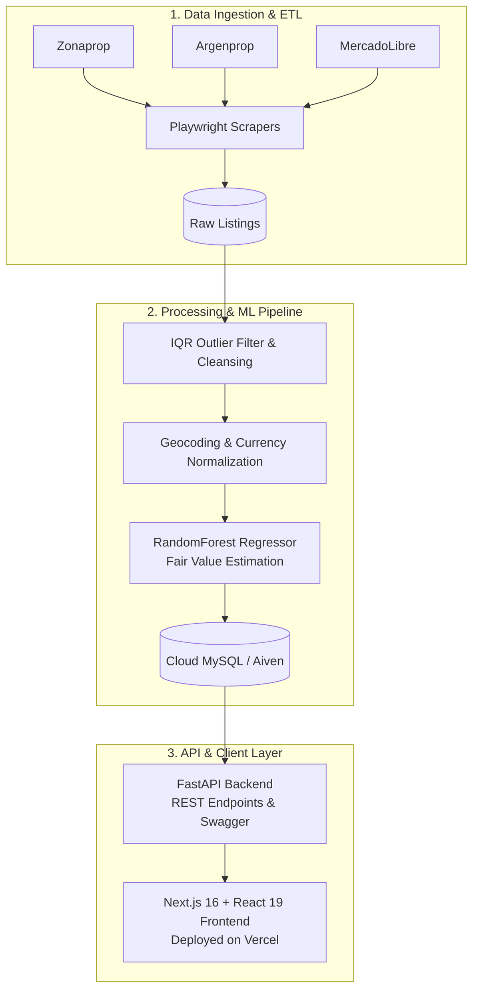

<div align="center">

# 🏢 Mochiptos | Real Estate Intelligence & Automated ML Valuation Platform

[](https://mochiptos.vercel.app)
[](https://fastapi.tiangolo.com/)
[](https://nextjs.org/)
[](https://react.dev/)
[](https://scikit-learn.org/)
[](https://playwright.dev/)

An end-to-end real estate intelligence and automated valuation platform covering the Buenos Aires property market. The system continuously ingests, cleanses, and structures **92,000+ live property listings**, evaluates fair market valuation with a trained **RandomForest Regressor**, and surfaces undervalued investment opportunities via an asynchronous modern dashboard.

[Live Demo](https://mochiptos.vercel.app) · [Report Bug](https://github.com/mooch10/mochiptos/issues) · [Request Feature](https://github.com/mooch10/mochiptos/issues)

</div>

---

## 🌟 Key Highlights & Engineering Impact

* **High-Throughput Scraping & Anti-Bot Bypass:** Distributed extraction pipelines built with **Playwright** and **BeautifulSoup**, featuring stealth headless browsing, custom headers, and request throttling to reliably ingest listings from leading real estate portals (Zonaprop, Argenprop, MercadoLibre).
* **Robust Data Cleansing & Statistical Outlier Removal:** Implemented **IQR (Interquartile Range)** algorithms in **Pandas/NumPy** to filter out distorted prices, fraudulent listings, and anomalous square-meter values across all 48 official Buenos Aires neighborhoods.
* **Predictive ML Opportunity Engine:** Production-ready **RandomForest Regressor** trained on normalized square-footage ratios, location features, and amenities with logarithmic target scaling (`log1p`/`expm1`) to estimate intrinsic property value and identify mispriced deals.
* **Modern Decoupled Architecture:** High-performance asynchronous **FastAPI** backend integrated via **SQLAlchemy ORM** to a managed cloud database (**Aiven MySQL**), paired with a **Next.js 16 (Turbopack) & React 19** frontend.

---

## 📐 System Architecture



---

## 🚀 Core Features

| Feature | Endpoint / Route | Description |
| :--- | :--- | :--- |
| **ML Opportunity Finder** | `/oportunidades` | Real-time Top 50 ranked undervalued listings by comparing published price vs. ML-estimated fair value (calculating instant USD equity margin). |
| **Neighborhood USD/m² Index** | `/mercado` | Robust median square-meter valuation metrics across 48 neighborhoods adjusted via statistical IQR filters. |
| **Universal Live Search** | `/buscador` | High-performance interactive multi-filter query engine spanning the 92,000+ property database. |
| **Financial Simulators** | `/calculadoras` | Real-time mortgage loan simulators (UVA, USD, ARS) and official lease adjustment calculators (ICL / IPC inflation index). |

---

## 🛠️ Tech Stack

* **Backend & ML:** Python, FastAPI, Scikit-Learn, Pandas, NumPy, SQLAlchemy, PyMySQL, Uvicorn.
* **Web Scraping:** Playwright, BeautifulSoup4, HTTPX.
* **Frontend:** Next.js 16 (App Router, Turbopack), React 19, Tailwind CSS, Framer Motion, Recharts, Lucide Icons.
* **Database & Cloud:** Managed MySQL on Aiven Cloud, Vercel (Frontend Hosting).

---

## ⚡ Quickstart & Local Setup

### Prerequisites
* Python 3.10+
* Node.js 18+ and `npm`

### 1. Backend Setup (FastAPI)
```bash
# Clone the repository
git clone https://github.com/mooch10/mochiptos.git
cd mochiptos/backend

# Create and activate virtual environment
python -m venv venv
# On Windows:
.\venv\Scripts\activate
# On macOS/Linux:
source venv/bin/activate

# Install dependencies
pip install -r requirements.txt

# Configure environment variables (.env)
cp .env.example .env

# Run FastAPI development server
python main.py
```
* Interactive Swagger Docs: `http://127.0.0.1:8000/docs`

### 2. Frontend Setup (Next.js)
```bash
cd ../frontend

# Install node dependencies
npm install

# Start development server
npm run dev
```
* Application will be live at: `http://localhost:3000`

---

## 🔒 Environment Variables Reference

Create a `.env` file in `/backend`:
```env
DB_HOST=your-cloud-mysql-host.aivencloud.com
DB_PORT=your-db-port
DB_USER=your-db-username
DB_PASSWORD=your-db-password
DB_NAME=your-db-name
```

---

## 👤 Author
**Andrés Gómez Pietrobono**  
* Buenos Aires, Argentina (Remote / UTC-3)
* LinkedIn: [linkedin.com/in/andres-gomez-95662826b](https://linkedin.com/in/andres-gomez-95662826b)
* GitHub: [@mooch10](https://github.com/mooch10)
